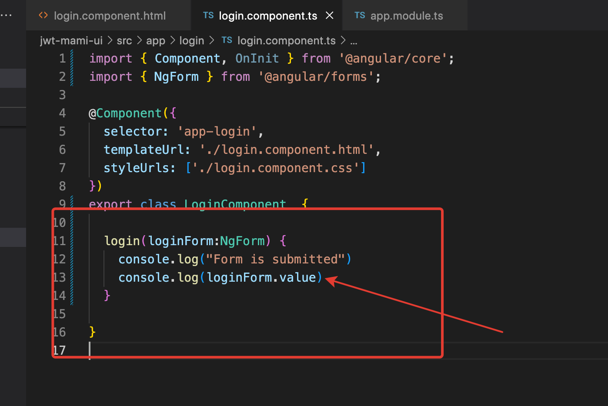
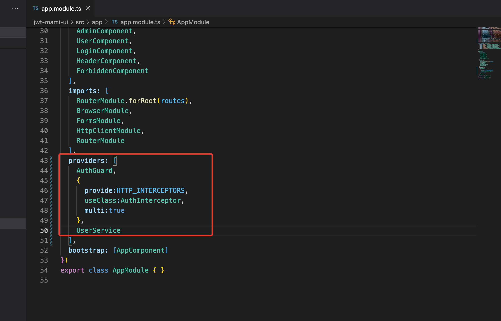
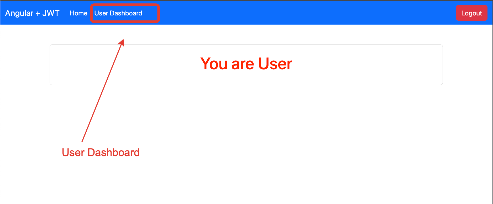

# 1 - Create project 

Create new branch  'jwt-mami-ui' from master 

# 2 - NPM Install bootstrap and JQuery

Once this installation is done we have to configure angular.json file

Now we have to open app.component.html file and remove everything,
and inside it write our simple implementation;

# 3 - Create components
Home component

As well we have to create admin , user , header , login ...

Now we have created our required components 

# 4 - Create services and auth folders

Inside app folder we will create __services_ folder
and __auth_ folder 

# 5 - Insert into header.component.hml code from bootstrap

- go to header.component.ts file and copy 'app-header' selector

- go to app.component.html file

And now after running the app we have 

- Edit header.component.html file . Remove and rename some elements

# 6 - Configure the paths  and editing home , admin and user html files

So in Angular, the app-routing.module.ts file is a common convention for defining and configuring the routing module for your Angular application. If your Angular project doesn't have an app-routing.module.ts file, you can manually create one. Here's a step-by-step guide:

Step 1: Create app-routing.module.ts 
Create a new file named` app-routing.module.ts` in the `src/app` directory of your Angular project.

Step 2: Create Component Files 
Our Components are created

Step 3: Update app.module.ts 
Open your `app.module.ts` file and import and add the `AppRoutingModule` to the imports array.

Step 4:

Make changes in the header-component-html file

Step 5: Use `<router-outlet>` in app.component.html
Open app.component.html and add the <router-outlet> element where you want the routed component to be displayed.

Now when we click, we have appropriate component in the view 

# 7 - Create form for login 

# 8 - Communication with the backend

user service - that service will hold all my endpoints 

For this we have to create the services 
Back to the terminal , inside __services_ folder

After creating the service , we open app.module.ts file

Now we have to open user.service.ts 
And edit it

Now we have to inject user-service in login-component

We have back end spring boot running . 
Remember when we run spring boot application we have 
a default admin-role-user is created by default 
login  - admin77
password - admin@password77

# 9 - Using Local Storage

[Article](https://blog.jscrambler.com/working-with-angular-local-storage)

We generate a new service 

This service will be responsible to communicate
with local storage

Inside `app.module.ts` we have to import `AppRoutingModule`

Editing user-auth.service.ts  
We have to save the roles and save the token as well ...

- setters for roles:[] and jwtToken:string 
- getters for roles:[] and jwtToken
- function that will clear the localStorage
- isLoggedIn() function
 

Inject new service in login.component.ts file

When we run the app with the backend

Make changes to login() function in login.component.ts file

And so on 

Write some logic , if when the logger is admin, then 
route to admin , else to user;

# 10 - Write logic for Login and Logout

We open the header.component.ts file 

File header.component.html, using directive *ngIf

Add logOut()

Edit header.component.html file -> add logOut() call
to click event 

# 11 - Show Admin or User Dashboard respectively to who is logged in

Inside `user.service.ts` we will write a new function `roleMatch(allowedRoles)` that will check the role we will pass

Inside header.component.ts we inject userService instance

Inside  header.component.html write conditions ising *ngIf

Now we have the app like this 
Home page

Entering admin credentials

Logged as admin - we have only admin dashboard active

# 12 - Passing the JWT token. Implement AuthGuard and Interceptor

When create AuthInterceptor, does not forget to add @Injectable

In Angular, AuthGuard and Interceptor are both concepts related to handling authentication and authorization within an application.

 - Authguard
`AuthGuard` is a class that implements the CanActivate interface in Angular's Router. It's used to control access to certain routes based on whether the user is authenticated or meets certain criteria. When a user tries to navigate to a route protected by an AuthGuard, Angular calls the canActivate method of that guard. If the canActivate method returns true, navigation is allowed; otherwise, the user is redirected to another route or denied access.

- Interceptor
Interceptors are middleware functions that you can use to intercept incoming or outgoing HTTP requests and responses. They're particularly useful for tasks like adding headers to requests, handling errors globally, or performing logging. Angular's HttpClient module allows you to attach interceptors to its pipeline.

Generate guard

Before writing anything in auth guard , 
we have to create an interceptor, so we 
can configure the interceptor

Then we go the app.module.ts file 

Now we have to write code inside interceptor and auth guard

Write code in interceptor 

------------------------------

Write code in auth guard 

-------------------------------

Make config changes to `app-routing.module.ts`

Testing manually the app 
We will create with postman a user to have one admin and one user 
in our application 

# 13 - Calling end points in the backend especially created for user and admin

We have to hit those endpoints from the UI

Inside user service we ill add two functions
`forAdmin()`
`forUser()`

Write the same thing for admin component, similar like in user component.